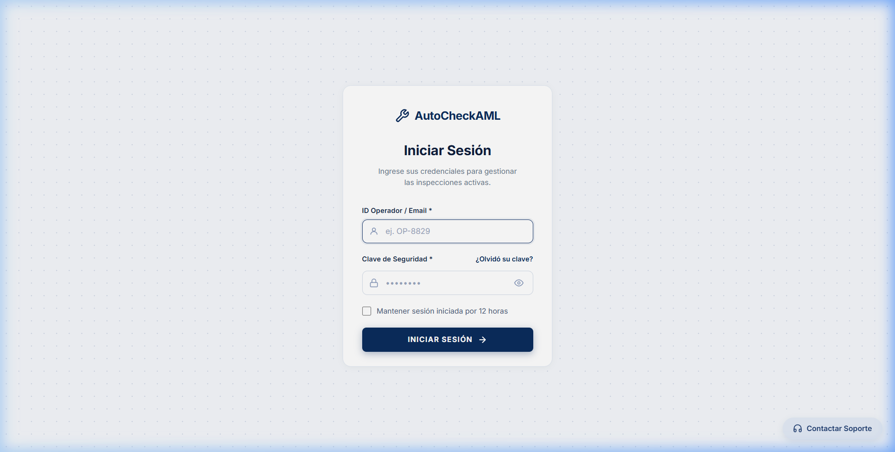
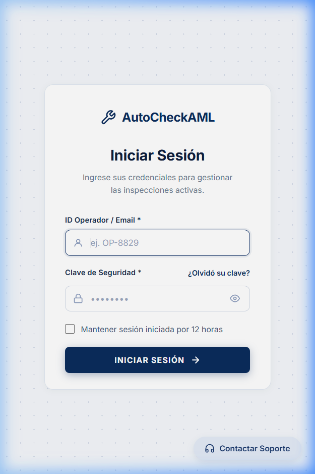
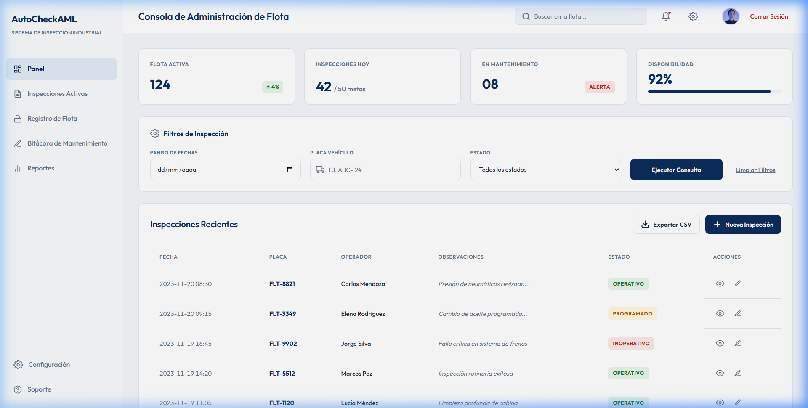
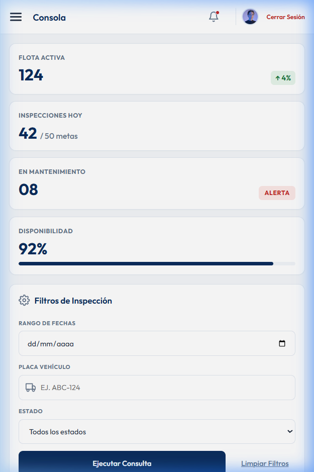
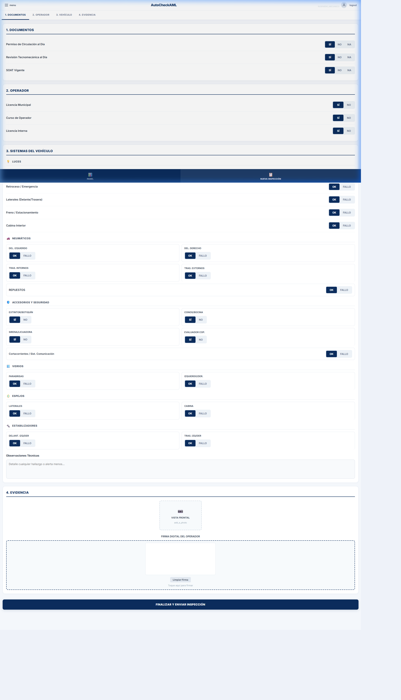
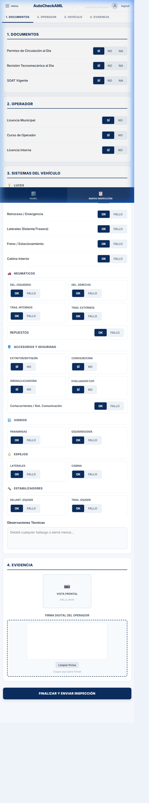
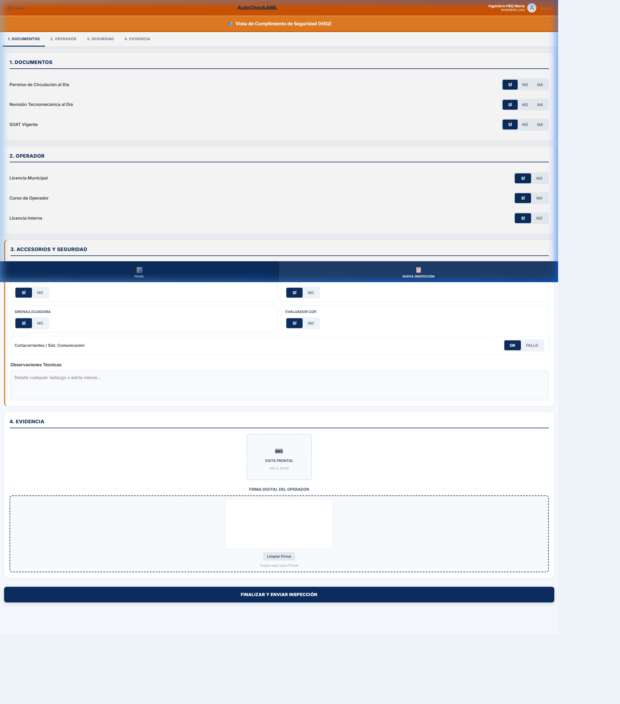
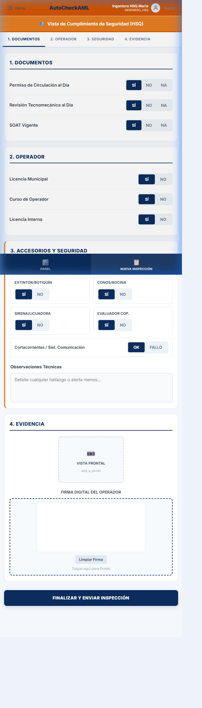
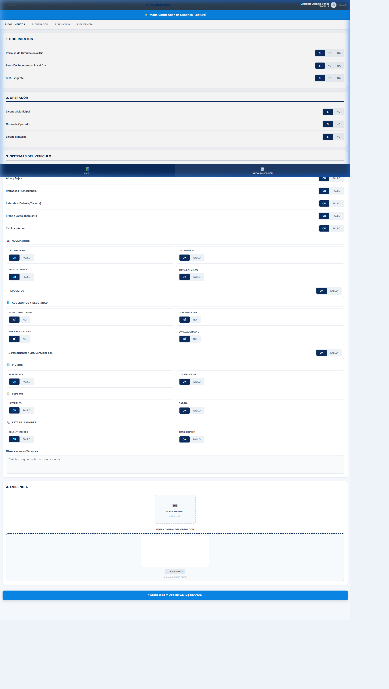
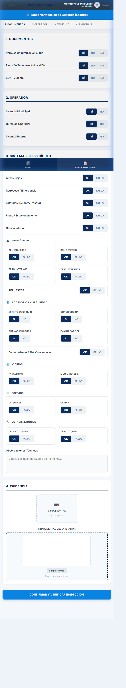

# Presentación de Avance: Sistema AutoCheckAML
**Para:** Gerencia General  
**De:** Equipo de Desarrollo de Software  
**Fecha:** Junio 12, 2026  
**Estado del Proyecto:** Fase de Personalización de Roles e Inicio de Servicios (MVP Completado)

---

## 🎯 Objetivo de la Aplicación
**AutoCheckAML** es una aplicación móvil y de escritorio diseñada para digitalizar, estructurar y controlar el proceso de inspección de vehículos de la flota de la empresa, garantizando la operatividad de los activos, la seguridad industrial y el estricto cumplimiento de la normativa de prevención de riesgos (AML/SST).

---

## 🔑 Avance Clave: Control de Acceso Basado en Roles (RBAC)
Para garantizar la integridad y confidencialidad de la información, el sistema ahora diferencia automáticamente la interfaz y los formularios según las credenciales del usuario autenticado:

1. **Administrador del Sistema (DEV/SOFTWARE)**: Accede a un panel ejecutivo completo para monitoreo global, auditorías y exportaciones.
2. **Ingeniero Mecánico**: Diligencia el formulario de inspección técnica vehicular de forma íntegra.
3. **Ingeniero de Seguridad (HSQ)**: Visualiza un formulario optimizado para cumplimiento de seguridad e higiene, ocultando información puramente técnica/mecánica.
4. **Cuadrilla**: Visualiza el formulario en modo de solo lectura/verificación para auditorías en campo y rectificación de datos, impidiendo alteración de las respuestas originales de los operadores.

---

## 📸 Vistas Diseñadas (Desktop vs. Mobile)

````carousel
### 1. Pantalla de Inicio de Sesión (Login)
Formulario con diseño moderno, campos vacíos por defecto por seguridad y acceso directo a soporte técnico.

* **Desktop View**:


* **Mobile View**:


<!-- slide -->
### 2. Panel de Control de Administración (AdminPanel)
Tablas de visualización global, indicadores ejecutivos e historial de logs accesible solo para la gerencia y administradores de software.

* **Desktop View**:


* **Mobile View**:


<!-- slide -->
### 3. Formulario Completo - Ingeniero Mecánico
Permite al personal mecánico reportar el estado de todos los sistemas vehiculares (Luces, Neumáticos, Vidrios, Espejos, Estabilizadores) con selectores interactivos táctiles y firma digital.

* **Desktop View**:


* **Mobile View**:


<!-- slide -->
### 4. Formulario Filtrado - Ingeniero HSQ
Filtra y oculta las preguntas mecánicas pesadas, mostrando únicamente secciones de **Documentos**, **Licencia del Operador** y **Accesorios y Seguridad (Extintor, Botiquín, Conos, Sirena)** con un tema visual en naranja de seguridad.

* **Desktop View**:


* **Mobile View**:


<!-- slide -->
### 5. Modo Verificación - Cuadrilla
Presenta un banner superior indicativo, deshabilita la edición de los campos del formulario para garantizar la inmutabilidad de la información del operador y adapta el botón a **"Confirmar y Verificar"** en tono azul.

* **Desktop View**:


* **Mobile View**:

````

---

## 🚀 Próximos Pasos en el Plan de Acción
* **Sprint 3**: Implementación de base de datos relacional robusta (SQL Server en producción) y validaciones dinámicas avanzadas.
* **Sprint 4**: Módulo de gestión y asignación de equipos de trabajo (Crews).
* **Sprint 5**: Integración con servicios de alertas automatizadas y reportes en PDF por correo.
* **Sprint 6**: Pruebas de carga de concurrencia y despliegue final en la nube.
